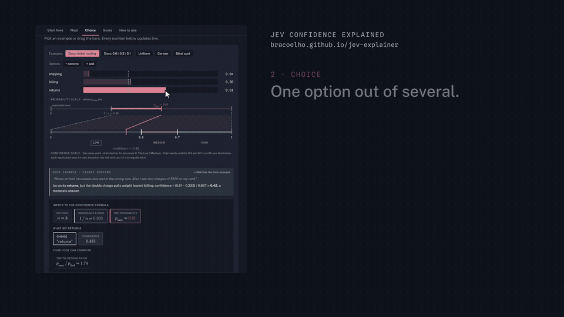
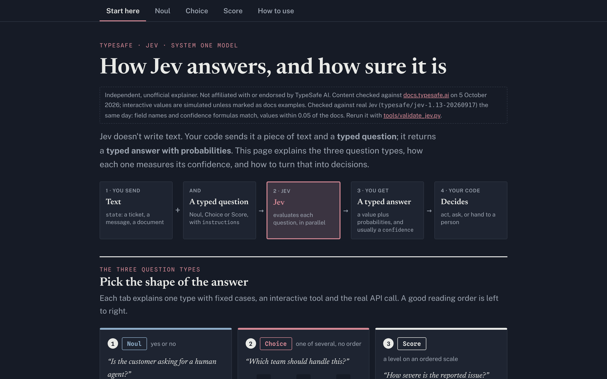

# Jev Confidence Explained

**Interactive tools that show how to use Jev, where its confidence misleads, and how to harden your system for the edge cases.**

The same confidence, 0.40, can describe a close two-way race or one clear leader with scattered runners-up. Drag the bars, see why, then fix your routing before production finds out.

### [Open the live explainer →](https://bracoelho.github.io/jev-explainer/) &nbsp;·&nbsp; [Watch the 70-second tour](https://bracoelho.github.io/jev-explainer/docs/jev-teaser.mp4)

[](https://bracoelho.github.io/jev-explainer/)
[](#checked-against-real-jev)
[](LICENSE)
[](LICENSE-CONTENT.md)



> Independent and unofficial. Not affiliated with or endorsed by TypeSafe AI. Content checked against [docs.typesafe.ai](https://docs.typesafe.ai/) on 5 October 2026. Interactive values are simulated unless marked as docs examples.

## The idea in 60 seconds

Jev answers a typed question with probabilities. Every confidence number in this explainer measures one thing: **how far the answer sits from "no idea"**, rescaled so that "no idea" is 0 and certainty is 1.

| Type | You ask | Jev returns | "No idea" looks like | Confidence |
|---|---|---|---|---|
| **Noul** | a yes or no question | `noul`, the probability of yes | 0.5, a coin flip | not returned; you can compute `\|2p − 1\|` |
| **Choice** | one option out of n, no order | `choice`, `probabilities`, `confidence` | every option at 1/n | `(p_max − 1/n) / (1 − 1/n)` |
| **Score** | a level on an ordered scale | `score`, `probabilities`, `confidence` | probability spread evenly over the levels | `1 − d / MAD_uniform`, where d is the average distance from the peak level |

## Three things you will see for yourself

1. **Your threshold is a business decision.** Noul returns a probability, not a verdict. Move the threshold and watch six real messages from the docs switch between yes and no. Confidence never moves, because it depends on the probability alone.
2. **The blind spot.** `(0.6, 0.4, 0)` and `(0.6, 0.2, 0.2)` both give Choice confidence 0.40. The top-to-second ratio, 1.5 against 3.0, tells them apart, and you can compute it from `probabilities`.
3. **On a scale, distance matters.** With 0.6 on the top level, Score confidence is 0.67, 0.33 or 0, depending on how far away the remaining 0.4 sits. Choice would report 0.50 for all three.

## What's inside



| Tab | What you learn |
|---|---|
| **Start here** | How a request flows, the three question types, and the idea behind every confidence number. |
| **Noul** | Yes or no questions. One probability comes back; your threshold turns it into a decision. |
| **Choice** | One option from an unordered set. Confidence climbs from the floor 1/n to certainty, and the same 0.40 can hide very different situations. |
| **Score** | A level on an ordered scale. Confidence measures how far the probability sits from the peak, and the `score` average can hide disagreement. |
| **How to use** | Choice, Score or Noul: a side-by-side table, quick tests, what breaks with the wrong type, and a worked example with the fix. |

Every tab has fixed worked cases, an interactive simulator and the real API request and response.

## Checked against real Jev

On 5 October 2026 the docs' examples went to the real model, `typesafe/jev-1.13-20260917`, through OpenRouter's System One endpoint:

- **Field names** match the page for all three types.
- **Confidence formulas** match: Choice returned 0.46 and the formula gives 0.46; Score returned 0.83 and the formula gives 0.835 on rounded probabilities.
- **Values** land within 0.05 of the docs' published numbers.

Rerun it with your own key:

```bash
export OPENROUTER_API_KEY=...      # your key; never commit it
python3 tools/validate_jev.py      # writes tools/validation-results.json
```

The results from 5 October are in [`tools/validation-results.json`](tools/validation-results.json).

## Run it locally

The explainer is one self-contained HTML file. Open `index.html` in a browser, or serve the folder with any static host. GitHub Pages serves it as it is.

## Sources

- [Confidence](https://docs.typesafe.ai/confidence)
- [Noul](https://docs.typesafe.ai/primitives/noul) · [Choice](https://docs.typesafe.ai/primitives/choice) · [Score](https://docs.typesafe.ai/primitives/score)
- [Confidence-gated routing](https://docs.typesafe.ai/patterns/confidence-routing)

## Author

Bruno Coelho. Corrections and ideas are welcome as [issues](https://github.com/bracoelho/jev-explainer/issues).

## License

- **Code** (JavaScript in `index.html`, `tools/`): [MIT](LICENSE)
- **Text, explanations and media**: [CC BY 4.0](LICENSE-CONTENT.md). Reuse freely, with credit to Bruno Coelho.

Quotes from docs.typesafe.ai remain TypeSafe AI's. "TypeSafe" and "Jev" are names of their respective owners.
